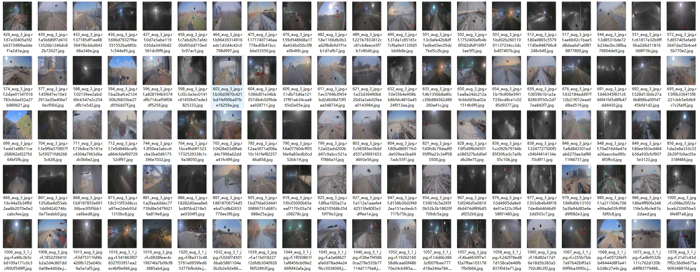
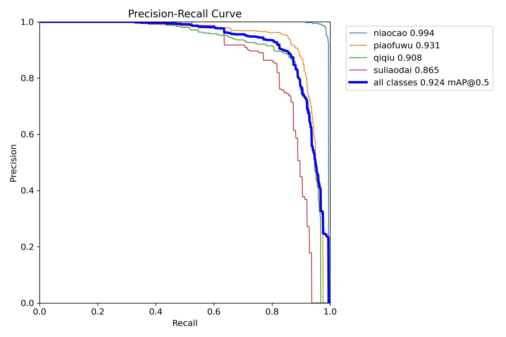
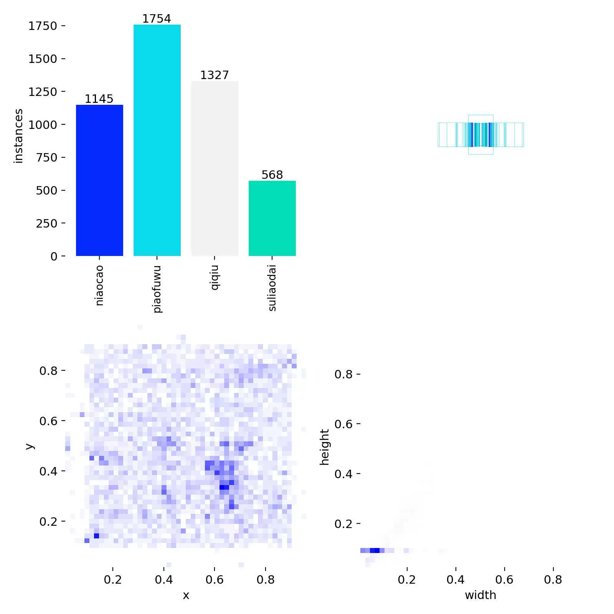
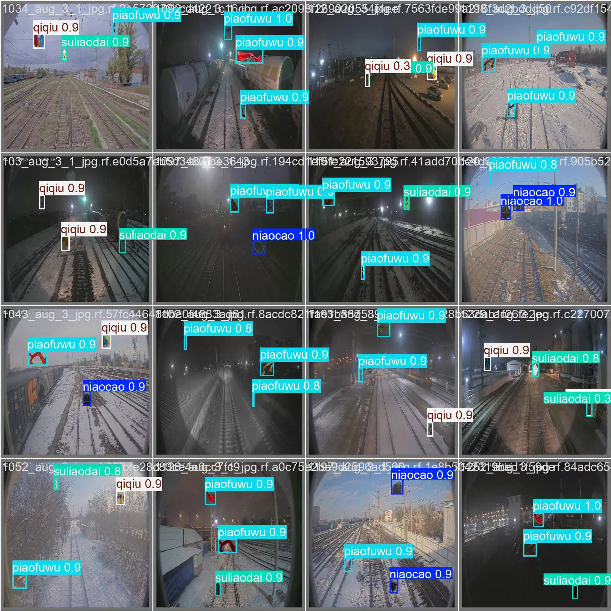
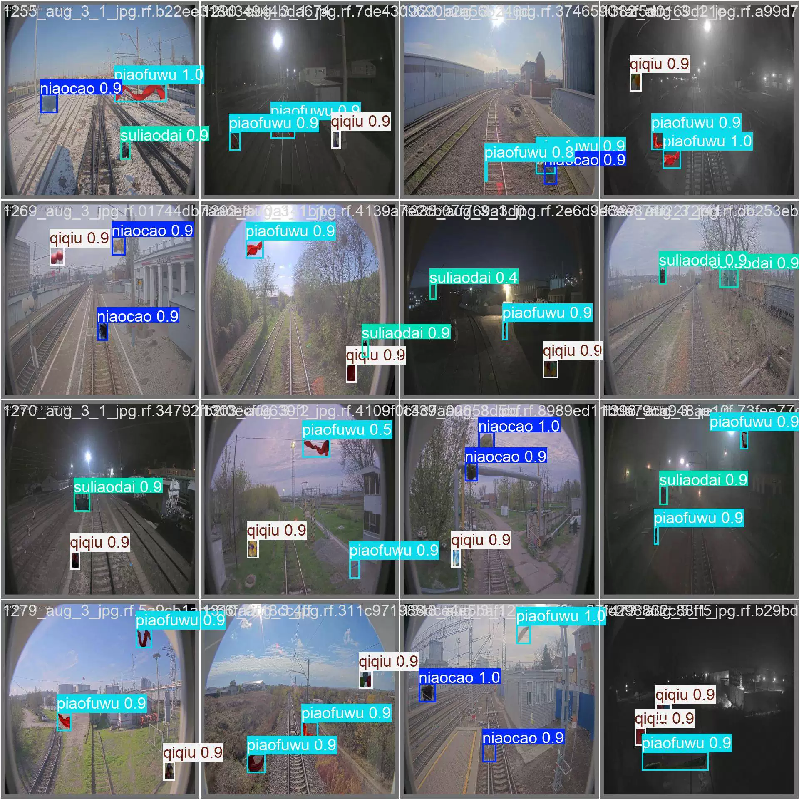
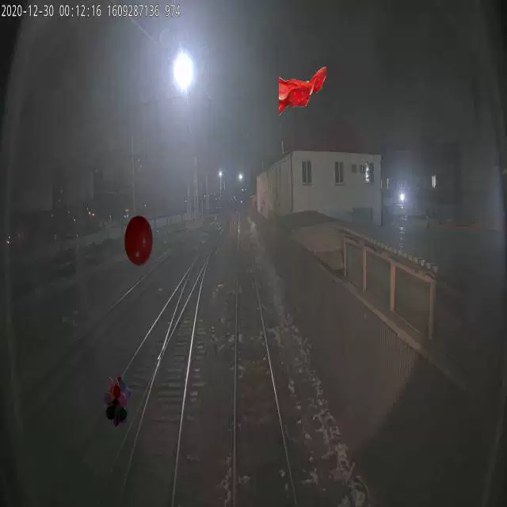
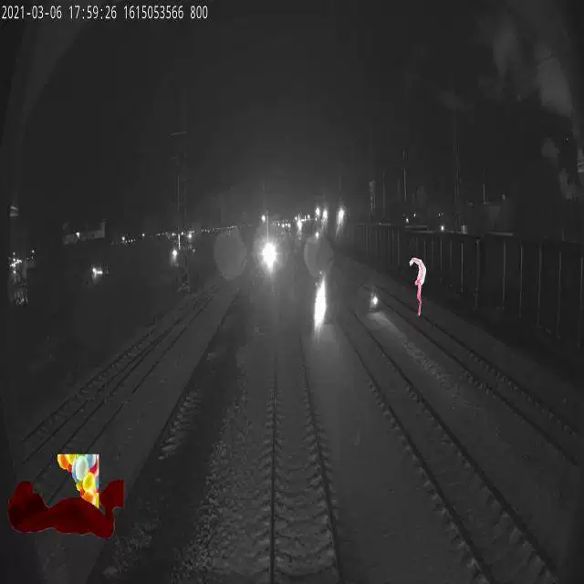

## Body

The Railway Identity Object Detection dataset in YOLO format includes 2541 images, labeled with their respective categories. The dataset has been divided into four classes: niaocao (train), piaofuwu (train), qiqiu (train), and suliaodai (test).

The YOLOv8s target detection weights file (with 100 training rounds and the pre-trained model YOLOv8s.pt) along with the training results file is provided.

## Images

Here is a pay link on Stripe ( https://buy.stripe.com/3cs8yP7sY87d0vu9AB ). Please contact me lonlonago@foxmail.com after funding $89, and I will send you a complete data files , thank you!

